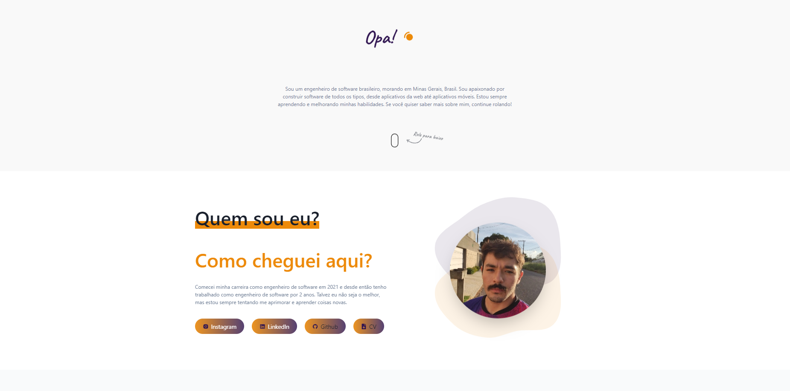

<h1 align="center">
  💻 Portfólio - Gunichi
</h1>

>
<h4 align="center"><a href="https://gunichi.me/pt">Quer ver o projeto melhor? Clique aqui!</a></h4>

## 💼 Tecnologias utilizadas

Para o desenvolvimento deste site utilizei as seguintes tecnologias:

- React 
- NextJS
- Typescript
- Css

<h2>👨‍💻 Autor</h2>

<table>
  <tr>
    <td align="center">
      <a href="https://github.com/gunichi">
         
        
          <b>Gunichi</b>
        
      </a>
    </td>
  </tr>
</table>